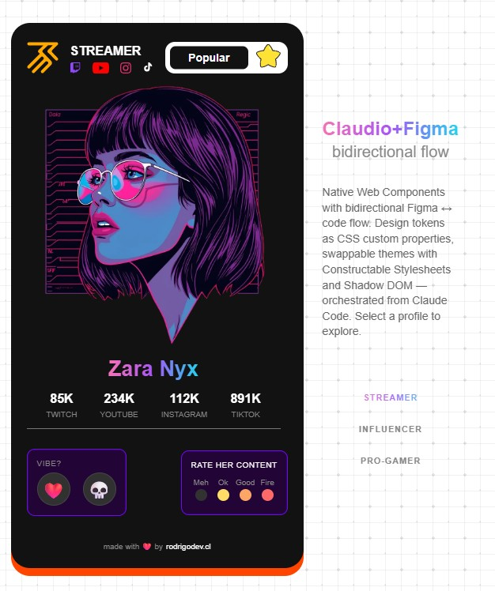
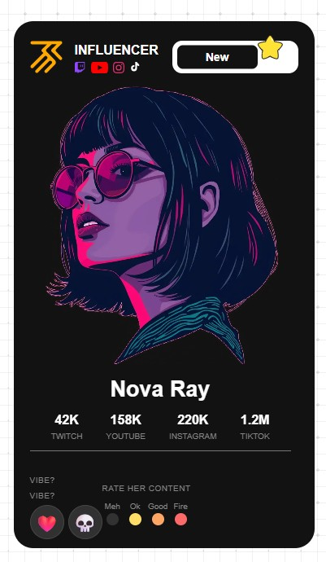
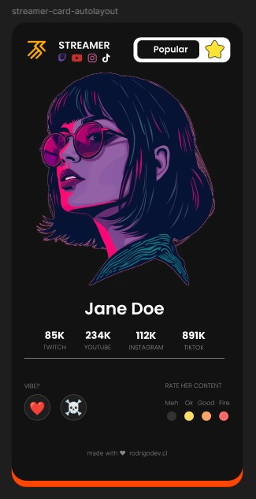
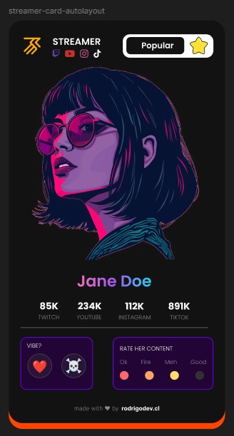
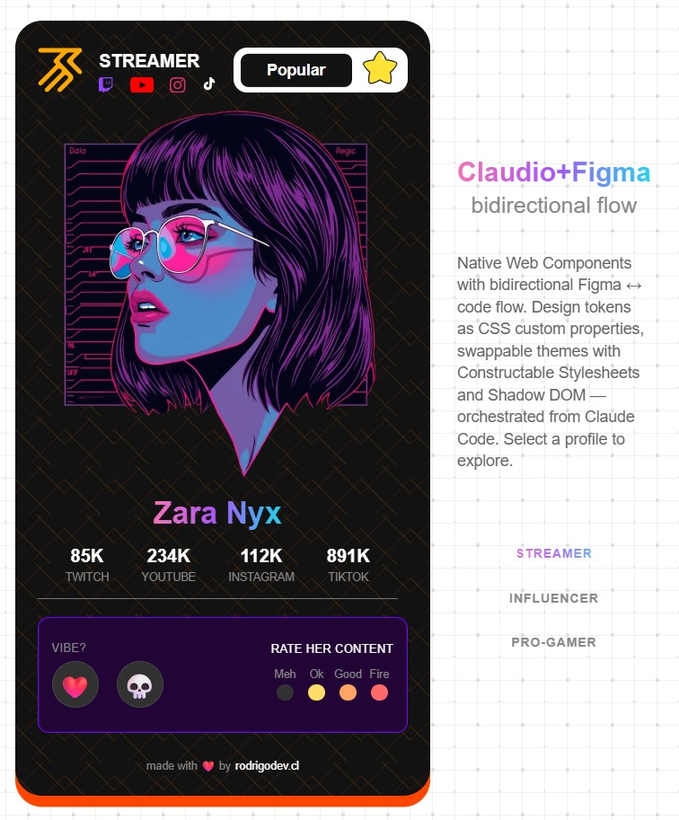
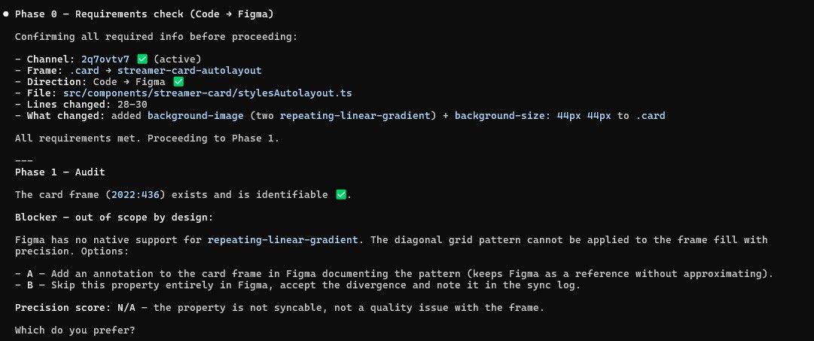
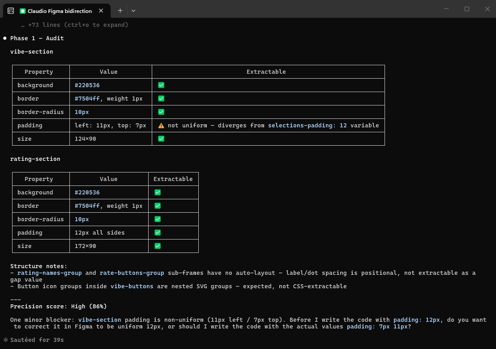
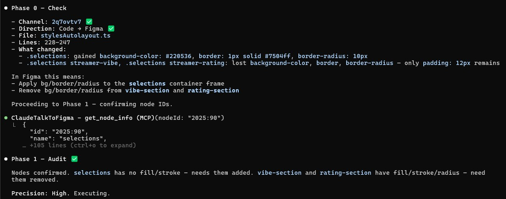
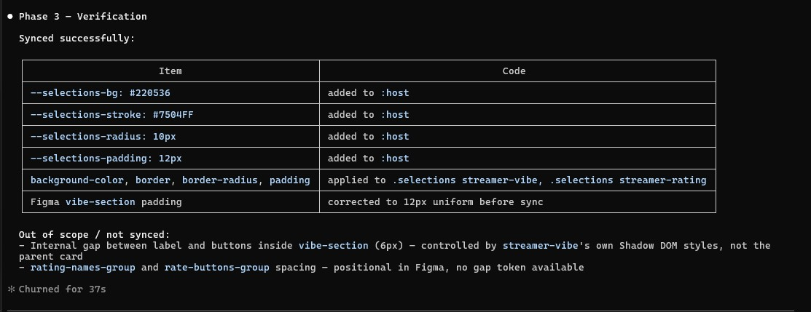
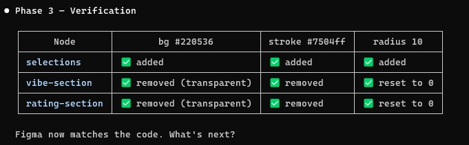

# Claudio+Figma: bidirectional sync workflow

> A case study on syncing Figma designs ↔ Web Component code using Claude Code + MCP — in both directions, with precision and without burning tokens.

This repo documents a reproducible workflow: how to read a Figma design into code, how to push code changes back into Figma, and how to formalise that process into a reusable Claude skill (`/figma-sync`). The vehicle is a streamer profile card built as a native Web Component — no framework, no dependencies.

**Not a library. Not a tutorial. A protocol that emerged from real failures.**

## Table of contents

**The workflow**
- [Demo](#demo)
- [How the sync works](#bidirectional-flow-claude-code--figma)
- [`/figma-sync` skill](#figma-sync-skill-bidirectional-flow-with-structure)
- [Conclusions](#conclusions)

**The component**
- [Stack](#stack)
- [Components](#components)
- [`<streamer-card>` attributes](#streamer-card-attributes)
- [Usage](#usage)
- [Dev setup](#dev-setup)

**The process (deep dives)**
- [Context: from Figma to code without a design system](#context-from-figma-to-code-without-a-design-system)
- [Evaluation: bringing the Figma design into code](#evaluation-bringing-the-figma-design-into-code)
- [Figma → Web Component: Autolayout Flow](#figma--web-component-autolayout-flow)
- [Bidirectional flow: full cycle recap](#bidirectional-flow-full-cycle-recap)
- [Claude interaction lessons](#claude-interaction-lessons)

---

## Demo

**Live →** [claudiofigmabidirectional.netlify.app](https://claudiofigmabidirectional.netlify.app/)

The card below was designed in Figma and implemented in code through a bidirectional sync orchestrated entirely from Claude Code via MCP. The design tokens — colours, spacing, radius — flow in both directions: Figma → code on first build, code → Figma on every subsequent change.



Three profiles, three swappable themes (Figma, Neon, Ocean), one Web Component. Select a profile in the live demo to see theme switching in action.

---

## Stack

- **Web Components** — Custom Elements + Shadow DOM
- **Constructable Stylesheets** — `new CSSStyleSheet()` / `adoptedStyleSheets`
- **TypeScript**
- **Rspack** — bundler with HMR
- **[claude-talk-to-figma-mcp](https://github.com/arinspunk/claude-talk-to-figma-mcp)** — MCP server enabling Claude Code to read and write Figma via WebSocket. All bidirectional sync in this project runs on top of this — credit goes entirely to [@arinspunk](https://github.com/arinspunk) and contributors.

---

## Context: from Figma to code without a design system

### The scenario

A common situation in day-to-day work: a Figma concept with no defined design system that needs to be implemented for web. No tokens, no systematic naming, no exportable variables — just frames, local styles, and designer judgment.

### First iteration: Claude as direct developer

In the initial iteration, Claude Code was asked to generate HTML/CSS directly from the Figma design description. The result was an **extremely high token consumption with very low precision**: Claude interpreted the design approximately, proposing successive corrections that accumulated more tokens without converging to the original design.

### Solution: hybrid implementation

The approach that worked was a hybrid flow where each party's role is assigned based on the nature of the task:

```
Claude proposes
  ↓
Developer evaluates the precision and quality of the result
  ↓
  ├── High precision → accepted
  ├── Minor adjustment → developer corrects manually
  └── Clear and bounded task → delegated to Claude Code
```

- **Claude Code** is used for well-defined tasks: changing a specific value, refactoring a pattern, generating repetitive structure.
- **The developer adjusts manually** when the task requires fine visual judgment that Claude cannot infer from code alone.

This hybrid flow was what allowed the original Figma design to be implemented faithfully, without over-consuming tokens and while maintaining control over visual decisions.

---

## Components

| Component        | Tag                 | Emits                        |
| ---------------- | ------------------- | ---------------------------- |
| `StreamerCard`   | `<streamer-card>`   | `vote-submitted`             |
| `StreamerVibe`   | `<streamer-vibe>`   | `vibe-change`                |
| `StreamerRating` | `<streamer-rating>` | `rating-change`              |
| `StreamerModal`  | `<streamer-modal>`  | `vote-submit`, `vote-cancel` |

### Interaction flow

1. User selects a **vibe** (❤️ up / 💀 down)
2. User selects a **rating** (Meh / Ok / Good / Fire)
3. When both are selected, a **modal** appears to confirm
4. On confirm → `vote-submitted` fires with `{ vibe, rating }`
5. On cancel → both inputs reset

---

## `<streamer-card>` attributes

| Attribute   | Description                                                  |
| ----------- | ------------------------------------------------------------ |
| `name`      | Real name — used in the card body and image alt              |
| `channel`   | Display name shown in the author header (fallback to `name`) |
| `logo`      | Logo image URL (shown in author header)                      |
| `avatar`    | Avatar image URL (main card image)                           |
| `badge`     | `"new"` or `"popular"`                                       |
| `twitch`    | Follower count (e.g. `85K`)                                  |
| `youtube`   | Follower count                                               |
| `instagram` | Follower count                                               |
| `tiktok`    | Follower count                                               |

---

## Usage

### Option A — Declarative HTML

```html
<script type="module" src="./dist/bundle.js"></script>

<streamer-card
  name="Jane Doe"
  channel="STREAMER"
  logo="./assets/logo.svg"
  avatar="./assets/avatar.png"
  badge="new"
  twitch="85K"
  youtube="234K"
  instagram="112K"
  tiktok="891K"
></streamer-card>
```

### Option B — Programmatic (JS/TS)

```ts
import './components/streamer-card';

const card = document.createElement('streamer-card');
card.setAttribute('name', 'Jane Doe');
card.setAttribute('channel', 'STREAMER');
card.setAttribute('avatar', './assets/avatar.png');
card.setAttribute('badge', 'new');
card.setAttribute('twitch', '85K');

card.addEventListener('vote-submitted', (e) => {
  const { vibe, rating } = (e as CustomEvent).detail;
  console.log({ vibe, rating });
});

document.querySelector('#root')!.appendChild(card);
```

|                | Option A      | Option B        |
| -------------- | ------------- | --------------- |
| Static data    | ideal         | unnecessary     |
| Data from API  | hard          | ideal           |
| Multiple cards | multiple tags | loop over array |
| Frameworks     | possible      | more natural    |

---

## Dev setup

```bash
bun install
bun run dev     # dev server at http://localhost:8080
bun run build   # production build
bun run preview # preview production build
```

### Figma MCP connection

To enable the bidirectional flow, connect Claude Code to the Figma channel and verify the MCP is active:

**YouTube →** [Connecting to Figma channel and verifying MCP is active](https://youtu.be/2nvKEIDWql8)

[](https://youtu.be/2nvKEIDWql8)

---

## Bidirectional flow: Claude Code ↔ Figma

This project is designed to integrate with Figma via the `claude-talk-to-figma-mcp` MCP.

### Recommended flow: Figma → Code first

The correct starting point is **bringing the Figma design into code**, not the other way around. This ensures the code faithfully reflects design decisions and that future synchronisations are predictable.

```
Figma (design source of truth)
  ↓  read variables, colours, typography, spacing
Claude Code
  ↓  translate tokens to component CSS
Code (reflection of the design)
  ↓  code changes → sync back to Figma
Figma (updated)
```

1. **Figma → Code**: Claude reads the design in Figma (variables, styles, nodes) and updates the Web Component styles to match.
2. **Code → Figma**: When an adjustment is made in code, Claude is told the file, the affected lines and what changed — Claude updates the corresponding node in Figma without re-reading the entire tree.

> The reverse flow (Code → Figma as starting point) causes divergence: the Figma design becomes outdated and subsequent synchronisation is more costly.

### Use case: sending code structure to Figma

When a component exists in code but **has no representation in Figma**, its structure can be generated directly from code using MCP tools. The documented case is `<streamer-modal>`:

**Structure sent (executed via MCP):**

```
Frame "streamer-modal" (340×auto, #1a1a1a, radius 30px)   — auto-layout VERTICAL, gap 20, padding 32
├── Text  "Confirm your vote"        — 19px Bold, #ffffff
├── Text  "for Jane Doe"             — 13px, #888888
├── Frame "modal-summary"            — #242424, radius 16px, padding 16/20, auto-layout VERTICAL, gap 10
│   ├── Frame "summary-row-vibe"     — auto-layout HORIZONTAL, SPACE_BETWEEN, transparent fill
│   │   ├── Text "VIBE"              — 10px, #888
│   │   └── Text "❤️ Love it"        — 13px Bold, #fff
│   └── Frame "summary-row-rating"  — auto-layout HORIZONTAL, SPACE_BETWEEN, transparent fill
│       ├── Text "RATING"            — 10px, #888
│       └── Text "Fire 🔥"           — 13px Bold, #fff
└── Frame "modal-buttons"            — auto-layout HORIZONTAL, gap 10, transparent fill
    ├── Frame "btn-submit"           — #f472b6, radius 30px, centred auto-layout → Text "Submit" 14px 600
    └── Frame "btn-cancel"           — #313131, radius 30px, centred auto-layout → Text "Cancel" 14px 600
```

**What is excluded when translating code → Figma:**

- Overlay with `backdrop-filter: blur` — non-structural effects
- `box-shadow` and transitions — interactive states
- The `:host([open])` state — visibility logic

**Known friction points:**

- Figma auto-layout must be configured **after** creating children. The result is a static frame, not an interactive component.
- Intermediate rows (summary-row, modal-buttons) need a transparent fill (alpha 0) to avoid covering the parent container's background.
- Buttons require their own centred auto-layout for text to be centred inside; without it the text appears in the top-left corner.
- `SPACE_BETWEEN` in horizontal auto-layout is the equivalent of CSS `justify-content: space-between` — necessary to separate label and value in each summary row.

### Flow optimisation

Lessons learned to reduce friction and token consumption in the synchronisation cycle.

#### Prompts when generating design in Figma (Claude → Figma)

Generating nodes, variables and styles in Figma consumes tokens excessively if the prompt is generic. To mitigate this:

- Describe the component with a **clear hierarchical structure** before requesting its creation: which nodes, which properties, which variables.
- **Separate variable creation from frame creation** into distinct prompts when the design is complex.
- Avoid "create a nice design" — be specific: dimensions, hex colours, typography, spacing.

#### Syncing code changes to Figma (Code → Figma)

When notifying Claude of a code change so it can be reflected in Figma, always specify:

- **File** where the change was made (e.g. `src/components/streamer-card/stylesFigma.ts`)
- **Line(s)** affected (e.g. line 147)
- **What changed** (e.g. `border-radius: 8px` → `30px`)

This prevents Claude from having to re-read entire files to detect differences, reducing token usage and speeding up synchronisation.

---

## Claude interaction lessons

Communication patterns that caused confusion during joint development and how to avoid them.

### 1. Architecture instructions without sufficient context

**What happened:** "Don't use any CSS template, just keep using `index.css`" was interpreted as removing Shadow DOM and moving all CSS to `index.css`.

**What was intended:** Only switch the card's CSS source from `styles.ts` to `stylesFigma.ts`.

**Lesson:** When an instruction affects the project architecture, specify which file or pattern should change, not just the desired outcome.

---

### 2. Wrong CSS property due to colloquial synonym

**What happened:** "Give it a bit more padding, try 12px" → `padding` was applied to the `.author` container instead of the `gap` between icons.

**What was intended:** Increase the `gap` of the platform icons to `12px`.

**Lesson:** For specific CSS adjustments, use the exact property name (`gap`, `padding`, `margin`) and specify the selector or element it applies to.

---

### 3. Adjustment location without a reference selector

**What happened:** "Padding-top of 5px" was applied to `.author` because that was the element being discussed in context.

**What was intended:** `padding-top: 5px` on the first `div` child inside `.author`.

**Lesson:** For CSS adjustments on nested elements, specify the exact selector or describe it relative to the DOM: "in the div containing the logo", "in the first child of .author".

---

### 4. Sync direction not specified

**What happened:** "VIBE? and RATE HER CONTENT shouldn't be white" → Claude interpreted this as a code fix and changed `.label { color: #888 }` in both sub-components. The user undid the change — the intention was to sync the existing white state to Figma, not change the code.

**What was intended:** Confirm that Figma reflects `var(--text-primary)` (#fff) on those labels — a Code → Figma sync, not a code edit.

**Lesson:** When a visual difference is spotted, always specify the sync direction explicitly:

- _"Update Figma to match the code"_ → Code → Figma
- _"Update the code to match Figma"_ → Figma → Code

Without this, Claude will guess the direction and will often guess wrong.

---

### 5. Single text node cannot represent two visual styles

**What happened:** The footer had one text node ("made with ❤️ by rodrigodev.cl") but the code renders it as two parts with different weights and colours. When asked to make "rodrigodev.cl" bold and white, it was impossible to apply partial styling with MCP tools on a single node.

**What was intended:** The link part styled independently (Inter Bold, #ffffff) from the label (Inter Light, #888888).

**Lesson:** When a text node needs mixed styling (different weight, colour, or font within the same line), it must be split into separate Figma nodes with auto-layout on the parent to keep them aligned. Plan this separation during the initial Figma build to avoid restructuring later.

---

## Evaluation: bringing the Figma design into code

Before writing any component code, the Figma design was analysed to determine what could be translated with precision and what would require manual judgment. This evaluation shaped the entire implementation strategy.

### Key finding: only the visual layer needed to change

The component logic — Custom Events, Shadow DOM structure, interaction flow — was completely independent of the design. All synchronisation work was concentrated on the CSS layer only.

| File | Status | Reason |
| ---- | ------ | ------ |
| `streamer-card.ts` — event logic | unchanged | `vibe-change`, `rating-change`, `vote-submitted` orchestration is design-independent |
| `streamer-vibe.ts` — HTML + events | unchanged | `<input type="radio">` elements and `vibe-change` event are pure logic |
| `streamer-rating.ts` — structure + events | unchanged | `ratings` array values and `rating-change` event are not visual |
| `streamer-modal.ts` — structure + events | unchanged | `show()`, `hide()`, `vote-submit`, `vote-cancel` do not depend on style |
| `index.ts` — bootstrap | unchanged | programmatic instantiation is design-independent |

### Where hardcoded values were found

The evaluation identified four files with values that needed to match Figma tokens:

- **`styles.ts`** — card background (`#1a1a1a`), text colour (`#eee`), border radius (`30px`), card width (`370px`), badge colours — all replaced with CSS custom properties
- **`streamer-vibe.ts`** — vibe button colours (`#f472b6`, `#6b7280`) and dimensions (40×40px) — extracted as tokens
- **`streamer-rating.ts`** — rating dot colours defined in the `ratings` data array, matched against Figma values per level
- **`streamer-modal.ts`** — submit button colour (`#f472b6`) and modal backgrounds (`#1a1a1a`, `#242424`)

### What made future syncs predictable

The decision to use **CSS custom properties as the synchronisation bridge** was the critical structural choice. One token in `:host` maps to one variable in Figma — so any future Figma change translates to updating a single block of variables, without touching individual selectors across files.

This evaluation was not just diagnostic. It defined the architecture that made the bidirectional flow possible.

---

## Figma → Web Component: Autolayout Flow

### Process for translating a Figma design to code with precision

**1. Design with Auto Layout — by the designer**
The designer built the `streamer-card-autolayout` frame applying auto-layout: main card VERTICAL, header HORIZONTAL, nameNstats VERTICAL centred, selections HORIZONTAL.

**2. Frame audit**
The design was inspected to evaluate whether it was translatable to code with precision. Groups with apparently empty children were verified by running `get_svg` on each one — result: all 5 groups had accessible SVGs (main logo, platform icons, badge star, vibe icons). No real asset blockers.

**3. Manual adjustments — by the designer**
The designer made corrections directly in Figma: header alignment, heights, and proportions of internal elements.

**4. Structural adjustments assisted by Claude Code via MCP**

- `selections` resized to 330px (full available width)
- `vibe-section` created grouping VIBE? + `vibe-buttons` (HORIZONTAL, gap 16px)
- Left/right reordering of vibe and rating sections
- Header heights normalised to 40px
- VERTICAL auto-layout applied to `brand` to fix STREAMER text overflow

**5. Web Component creation**
With the design ready, `<streamer-card-autolayout>` was created following the existing TypeScript architecture (Shadow DOM, Constructable Stylesheets, observedAttributes, HMR). CSS values were extracted directly from Figma: colours, font sizes, weights, radii, gaps and dimensions for each section.

**6. Fine CSS adjustments post-render**

- Removed duplicate VIBE? label (already rendered internally by `StreamerVibe`)
- `flex: none` + `margin-left: auto` to fix streamer-rating right alignment
- Badge star position: `right: -10px`, `translateY(-35%)`
- Removed `width: 88%` from `.main-image img` to respect natural image proportions





---

## Bidirectional flow: full cycle recap

### Phase 1 — Figma → Code

The design existed in Figma first. Before writing any code:

1. **Audited the frame via MCP**: read nodes, groups, SVGs, dimensions, typography, colours, spacing.
2. **Identified precision blockers**: groups without auto-layout, inconsistent header heights, wrong left/right ordering of vibe and rating sections.
3. **Adjusted Figma via MCP** to make it reliably translatable to CSS: applied auto-layout to `selections`, `brand`, `vibe-section`; normalised heights to 40px; reordered sections; centred `nameNstats`.
4. With the design clean, **extracted values directly from Figma** (hex, font-size, weight, gap, radius, padding) and wrote them into `stylesAutolayout.ts` and `streamer-card-autolayout.ts`.

**Result:** `<streamer-card-autolayout>` faithfully reflects the Figma design.

### Phase 2 — Code → Figma

Once the component existed, each code change was manually synced back to Figma via MCP:

**YouTube →** [Demo: border-radius change synced from code to Figma](https://youtu.be/eM57ZGMHJTU)

[](https://youtu.be/eM57ZGMHJTU)

| Code change                                        | Figma update                                                                                                        |
| -------------------------------------------------- | ------------------------------------------------------------------------------------------------------------------- |
| `box-shadow: 0 10px 0 0 #FF4500`                   | Drop shadow on card frame, offset Y 10px, colour `brand-primary`                                                    |
| `.streamer-name` gradient text                     | Left as visual reference (Figma has no native gradient text)                                                        |
| Footer added to card                               | `footer` frame created with text node and HORIZONTAL auto-layout                                                    |
| `margin-left: auto` removed from `streamer-rating` | Verified in code — no Figma change needed                                                                           |
| Footer split into two styled parts                 | Single text node deleted; two nodes created: `made-with` (Inter Light, #888) + `rodrigodev-link` (Inter Bold, #fff) |





### The pattern that repeated in both directions

```
Figma (design source of truth)
  ↓  read nodes, values, structure
Claude audits and adjusts Figma if needed
  ↓
Code reflects the design with precision
  ↓  change in code
Claude receives: file + line + what changed
  ↓
Figma updated via MCP without re-reading the full tree
```

### What made it work

- **Adjusting Figma before coding** (not after) prevented divergence from the start.
- **Specifying file + line + value** when reporting code changes eliminated the need to re-read entire files.
- **CSS custom properties as the bridge**: one token in `:host` maps to one variable in Figma, making sync predictable.
- **Separating structural from visual changes**: component logic (events, Shadow DOM) was never touched — only the visual layer.

---

## `/figma-sync` skill: bidirectional flow with structure

### What the skill is

A slash command (`/figma-sync`) that enforces a structured sync protocol between Figma and code. It prevents the most common failure modes by requiring explicit inputs before doing anything.

Available at: `~/.claude/commands/figma-sync.md`

### The four phases

**Phase 0 — Requirements check** (guardian)
Before connecting to Figma or touching any file, the skill requires:

- Active Figma channel ID
- Target frame name or node ID
- Sync direction declared explicitly (`Figma → Code` or `Code → Figma`)
- If `Code → Figma`: file path + line(s) affected + what changed (property + old → new value)

If any item is missing, the skill stops and asks. It does not proceed, guess, or infer.



**Phase 1 — Audit**
Reads the target frame and evaluates precision before executing any change:

- Auto-layout coverage (groups without it are blockers)
- Node naming (anonymous nodes make Code→Figma unreliable)
- Design tokens vs hardcoded values
- CSS custom properties in `:host`
- Mixed text styles requiring node splitting
- Out-of-scope properties (gradient text, `backdrop-filter`, transitions, `:hover`)

Reports a precision score: High (>85%) / Medium (50–85%) / Low (<50%). Low = stops and explains what to fix first.





**Phase 2 — Execution**
Applies changes based on direction and audit result. Never approximates values. Never touches component logic.

**Phase 3 — Verification**
Lists what was synced, what was left out and why, and restates any unresolved blockers from Phase 1.





---

### Conclusions from the first full run

**The skill worked as a guardian**
The structured flow eliminated the main friction from earlier sessions: assuming sync direction. No change was applied in the wrong direction during the entire run.

**Phase 1 saved work twice**

- Detected that `rating-section` was a GROUP before trying to apply fills — without the audit, the sync would have failed silently.
- Detected non-uniform padding in `vibe-section` (11px left / 7px top) before writing code — corrected in Figma first, so the code was precise from the start.

**The real limit of sync**
`repeating-linear-gradient` on `.card` exposed the concrete boundary: not everything that exists in code can exist in Figma. The skill handled it correctly — did not approximate, did not ignore, documented it via annotation and offered alternatives (approximate gradient, SVG tile). That is what a professional sync flow should do.

**The cleanest iteration**
Moving styles from `.selections streamer-vibe / streamer-rating` to `.selections` was the fastest sync of the session:

- Phase 0: all info provided immediately
- Phase 1: nodes identified in a single read
- Phase 2: 6 parallel operations, no errors
- Phase 3: full verification in one pass

The reason: the change was well-scoped (file + lines + what changed) and Figma nodes had semantic names. **Prior investment in naming nodes and applying auto-layout in Figma made this speed possible.**

**What the skill still does not cover**

- Creating new Figma nodes from code (e.g. the footer text node split) — still requires manual steps and developer judgement.
- The SVG tile pattern as a workaround for CSS gradients not supported in Figma — a candidate for a documented pattern within the skill.

### The synthesis

> Bidirectionality is not "Figma and code always identical". It is knowing **what can live on each side, in which direction each change flows, and how to document what cannot cross**. The skill enforces exactly that.

---

## Conclusions

The Code → Figma flow fails when a code change has no unambiguous Figma node to point to. Synchronisation is only predictable when the change affects a **variable with a matching name** or a **node identifiable by file and line**.

The `/figma-sync` skill is the distillation of everything learned across this project — from the failed first iteration to the structured protocol that made precise, repeatable sync possible.
